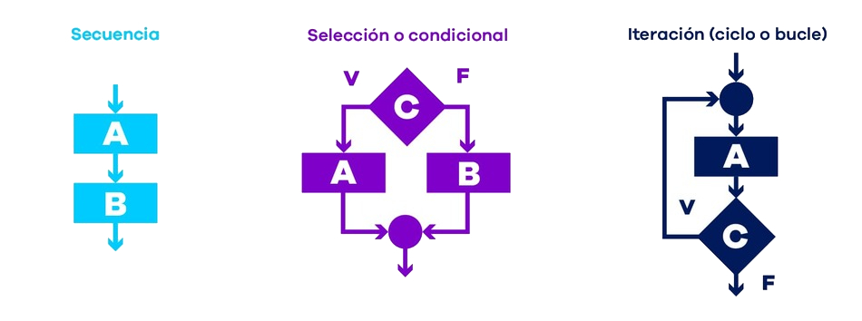

# Paradigmas de Programación

Los paradigmas de programación son los principios fundamentales de la programación de software. Son estilos de programación diferenciados que, en consecuencia, generan códigos software que están estructurados de forma distinta.


[Fuente](https://www.ionos.com/es-us/digitalguide/paginas-web/desarrollo-web/paradigmas-de-programacion/)


## Programación Imperativa

### ¿Qué es?

La programación imperativa (del latín imperare = ordenar) es el paradigma de programación más antiguo. De acuerdo con este paradigma, un programa consiste en una secuencia claramente definida de instrucciones para un ordenador. Se basa en dar instrucciones paso a paso a la computadora para cambiar el estado del programa.

El código fuente de los lenguajes imperativos encadena instrucciones una detrás de otra que determinan lo que debe hacer el ordenador en cada momento para alcanzar un resultado deseado.


Los lenguajes de programación imperativa más conocidos son:

- Fortran
- Java
- Pascal
- ALGOL
- C
- C#
- C++
- Ensambladores
- BASIC
- COBOL
- Python
- Ruby

### Características:

- El programa es una **secuencia de instrucciones**.
- Usa variables, asignaciones y estructuras de control.
- Modelo similar a una receta o conjunto de órdenes.

El enfoque imperativo permite al desarrollador escribir código que especifica los pasos que el equipo debe realizar para lograr el objetivo. A veces también se denomina programación algorítmica.

### Ejemplo en BASIC:

```basic
10 PRINT "PROGRAMA DE NOTAS"
20 LET S = 0
30 LET C = 0
40 INPUT "Ingresar nota (-1 para terminar): ", N
50 IF N = -1 THEN GOTO 100
60 IF N < 0 THEN GOTO 90
70 LET S = S + N
80 LET C = C + 1
85 GOTO 40
90 PRINT "Nota inválida"
95 GOTO 40
100 IF C = 0 THEN GOTO 150
110 LET P = S / C
120 PRINT "Promedio: "; P
130 IF P >= 6 THEN GOTO 140
135 PRINT "No aprobado"
137 GOTO 160
140 PRINT "Aprobado"
150 PRINT "No se ingresaron notas válidas"
160 PRINT "Fin del programa"
170 END
```


## Programación Estructurada

### ¿Qué es?

El enfoque estructurado de programación constituye una forma simplificada de programación imperativa. La principal modificación del principio básico radica en que, **en lugar de instrucciones de salto absolutas (instrucciones que provocan que el procesamiento no continúe con la siguiente instrucción, sino en otro lugar)** este paradigma de programación de software prevé el uso de bucles y estructuras de control. Un ejemplo de ello es el uso de “do...while” para realizar una instrucción de forma automática siempre que se dé una determinada condición (al menos una vez).
<br>

> Dijkstra descubrió que ciertos usos de las sentencias goto impiden que los módulos se descompongan recursivamente en unidades cada vez más pequeñas, lo que imposibilita el uso del enfoque de divide y vencerás necesario para realizar pruebas razonables.
Otros usos del goto, sin embargo, no presentaban este problema. Dijkstra se dio cuenta de que estos usos “buenos” del goto correspondían a estructuras de control simples de selección e iteración, como if/then/else y do/while. Los módulos que utilizaban únicamente ese tipo de estructuras de control podían subdividirse recursivamente en unidades demostrables.
>
> -- Bob Martin - Clean Architecture



### Características:

- Uso de funciones y procedimientos.
- Control del flujo con `if`, `while`, `for`, `switch`.
- Mejora la legibilidad y mantenimiento.

### Ejemplo en C#:

```c#
using System;

class ProgramaNotas
{
    static void Main()
    {
        int cantidad = 0;
        int suma = 0;

        LeerNotas(ref suma, ref cantidad);
        MostrarResultado(suma, cantidad);
    }

    static void LeerNotas(ref int suma, ref int cantidad)
    {
        bool isExitValue = false;

        while (!isExitValue)
        {
            int nota = PedirNota();
            isExitValue == -1;

            if (!isExitValue)
            {
                if (EsNotaValida(nota))
                {
                    suma += nota;
                    cantidad++;
                }
                else
                {
                    Console.WriteLine("Nota inválida.");
                }
            }
        }
    }

    static int PedirNota()
    {
        Console.Write("Ingresá una nota (-1 para terminar): ");
        return int.Parse(Console.ReadLine());
    }

    static bool EsNotaValida(int nota)
    {
        return nota >= 0;
    }

    static void MostrarResultado(int suma, int cantidad)
    {
        if (cantidad == 0)
        {
            Console.WriteLine("No se ingresaron notas válidas.");
        }
        else
        {
            double promedio = (double)suma / cantidad;
            Console.WriteLine($"Promedio: {promedio:F2}");

            if (promedio >= 6)
                Console.WriteLine("Aprobado");
            else
                Console.WriteLine("No aprobado");
        }
    }
}

```

### El siguiente código, ¿es estructurado o imperativo?
```c#
using System;

class ProgramaNotas
{
    static void Main()
    {
        int suma = 0, cantidad = 0;
        while (true)
        {
            Console.Write("Ingresá una nota (-1 para terminar): ");
            int nota = int.Parse(Console.ReadLine());

            if (nota == -1)
                break;

            if (nota < 0)
            {
                Console.WriteLine("Nota inválida.");
                continue;
            }

            suma += nota;
            cantidad++;
        }

        if (cantidad == 0)
        {
            Console.WriteLine("No se ingresaron notas válidas.");
            return;
        }

        double promedio = (double)suma / cantidad;
        Console.WriteLine($"Promedio: {promedio:F2}");

        if (promedio >= 6)
            Console.WriteLine("Aprobado");
        else
            Console.WriteLine("No aprobado");
    }
}

```


## Programación Orientada a Procesos

### ¿Qué es?

Una evolución de la estructurada que organiza el programa en procedimientos o funciones principales, tratando cada uno como una unidad de trabajo.

### Características:

- Separación clara entre entrada, procesamiento y salida.
- El programa se centra en los **datos y las funciones** que los manipulan.
- Se usa mucho en sistemas más antiguos o científicos.

## Programación Orientada a Objetos (POO)

### ¿Qué es?

Es un paradigma de programación en el que los objetos se utilizan como metáforas para representar las entidades reales de lo que queremos modelar.

### Características:

- Abstracción
- Encapsulamiento
- Herencia
- Polimorfismo.

### ¿Qué es una Clase?

Una **clase** es un molde o plantilla que define cómo serán los objetos.

```csharp
class Persona
{
    public string Nombre;
    public int Edad;

    public void Saludar()
    {
        Console.WriteLine($"Hola, soy {Nombre}");
    }
}
```


### Crear un Objeto

```csharp
Persona p = new Persona();
p.Nombre = "Ana";
p.Edad = 30;
p.Saludar(); // Hola, soy Ana
```

### Principios de la POO

#### 1. Encapsulamiento

Es el proceso en el cual se ocultan los detalles del soporte de las características de una abstracción.
 No se trata de ocultar las características en sí, sino de no mostrar cómo guardo o maneja internamente esas características.
 Por ej, de la clase fecha nos interesa obtener el día, mes y año. Y no como esta guardado.

```csharp
class CuentaBancaria
{
    private double saldo = 0;

    public void Depositar(double monto)
    {
        saldo += monto;
    }

    public double ConsultarSaldo()
    {
        return saldo;
    }
}
```

#### 2. Abstracción

Es el proceso mental de extracción de las características esenciales de algo, ignorando los detalles superficiales

| Coche alquilado          | Coche particular                      | Coche para repartos         |
|--------------------------|----------------------------------------|-----------------------------|
| La tarifa                | Consumo                                | Consumo                     |
| Limitación de kms        | El color                               | Carga soportada            |
| ¿Consumo?                | Valor de reventa                       | Garantía                   |
|                          | Duración de los componentes           |                             |


#### 3. Herencia

Una clase puede heredar atributos y métodos de otra.

```csharp
class Animal
{
    public void Dormir() => Console.WriteLine("Zzz...");
}

class Perro : Animal
{
    public void Ladrar() => Console.WriteLine("Guau!");
}
```

#### 4. Polimorfismo

Permite que una misma acción se comporte de distintas formas según el objeto.

```csharp
class Animal
{
    public virtual void HacerSonido()
    {
        Console.WriteLine("Sonido genérico");
    }
}

class Gato : Animal
{
    public override void HacerSonido()
    {
        Console.WriteLine("Miau");
    }
}
```

## Modificadores de Acceso

| Modificador | Significado                          |
|-------------|---------------------------------------|
| `public`    | Accesible desde cualquier lugar       |
| `private`   | Accesible solo dentro de la clase     |
| `protected` | Accesible desde la clase y derivadas  |
| `internal`  | Accesible dentro del mismo ensamblado |

## Constructores

Método especial que se ejecuta al crear una instancia.

```csharp
class Persona
{
    public string Nombre;

    public Persona(string nombre)
    {
        Nombre = nombre;
    }
}
```

## Propiedades

Son una forma de exponer campos privados de manera segura.

```csharp
class Producto
{
    private decimal precio;

    public decimal Precio
    {
        get { return precio; }
        set
        {
            if (value >= 0)
                precio = value;
        }
    }
}
```

## Interfaces

Definen un contrato que las clases deben cumplir.

```csharp
interface IVehiculo
{
    void Conducir();
}

class Auto : IVehiculo
{
    public void Conducir()
    {
        Console.WriteLine("Conduciendo...");
    }
}
```

### Ejemplo de clase Calculadora orientado a objetos

```
class Calculadora
{
    private double numero1;
    private double numero2;

    public Calculadora(double n1, double n2)
    {
        numero1 = n1;
        numero2 = n2;
    }

    public double Sumar()
    {
        return numero1 + numero2;
    }

    public double Restar()
    {
        return numero1 - numero2;
    }

    public double Multiplicar()
    {
        return numero1 * numero2;
    }

    public double Dividir()
    {
        if (numero2 == 0)
            throw new DivideByZeroException("No se puede dividir por cero.");
        return numero1 / numero2;
    }
}
```

### Ejemplo de clase Calculadora, ¿orientado a objetos?

```
class Calculadora
{
    public Calculadora(double n1, double n2)
    {
    }

    double Sumar(double a, double b)
    {
        return a + b;
    }

    double Restar(double a, double b)
    {
        return a - b;
    }

    double Multiplicar(double a, double b)
    {
        return a * b;
    }

    double Dividir(double a, double b)
    {
        if (b == 0)
            throw new DivideByZeroException("No se puede dividir por cero.");
        return a / b;
    }
}
```

## Comparación entre Paradigmas

| Paradigma           | Énfasis           | Unidades principales       | Nivel de abstracción |
|---------------------|-------------------|----------------------------|----------------------|
| Imperativo          | Instrucciones     | Variables, asignaciones    | Bajo                 |
| Estructurado        | Control de flujo  | Funciones, bloques         | Medio                |
| Orientado a Procesos| Funcionalidad     | Procedimientos             | Medio                |
| Orientado a Objetos | Datos y comportamiento | Clases, objetos       | Alto                 |

## Evolución Histórica

| Década | Paradigma dominante               | Lenguajes destacados       |
|--------|-----------------------------------|----------------------------|
| 1950s  | Imperativo                        | Assembly, Fortran          |
| 1970s  | Estructurado                      | C, Pascal                  |
| 1980s  | Orientado a Procesos              | Ada, Modula-2              |
| 1990s  | Orientado a Objetos               | C++, Java                  |

## Relaciones entre clases
Las clases, al igual que los objetos, no existen de modo aislado. La Orientación a Objetos (POO) intenta modelar aplicaciones del mundo real y por lo tanto debe reflejar estas relaciones.
Si dos objetos colaboran, a través del paso de mensajes, sus respectivas clases están relacionadas.

>Existen tres tipos básicos de relaciones entre clases:
>- La primera es la generalizacion/especializacion, que denota una relacion 'es un'. Por ej, una rosa 'es una' flor, lo que quiere decir que una rosa es una subclase especializada de una clase mas general, la de las flores.
>- La segunda es la relacion 'composición/agregación' (también conocida como 'todo/parte'), que denota una relacicón 'parte de'. Asi, un petalo no es un tipo de flor; es parte de una flor.
>- La tercera es la asociación, que denota alguna dependecia semántica entre clases de otros modos indpedientes, como entre las abejas y las flores.>
>
>Grady Booch [Booch, 94]

### Relación de Composición/Agregación

Es la relación que se constituye entre el todo y la parte. Se puede determinar que existe una relación de composición entre la clase A (el todo) y la clase B (la parte), si un objeto de la clase A “tiene un” objeto de la clase B.

La relación de composición no abarca simplemente cuestiones físicas (libro y páginas), como “contiene un” (aparato digestivo y bolo alimenticio). Sino también, a relaciones lógicas que respondan adecuadamente al todo y a la parte como “posee un” (propietario y propiedades).

Nota:
- *todo* es sinónimo de *contenedor*. Es la clase *cliente* que utiliza a la otra clase.
- *parte* es sinónimo de *contenido*. Es la clase que ofrece los servicios a *su/s cliente/s*.

#### Composición
Es una relación donde la vida del objeto de la clase *contenida* debe coincidir con la vida de la clase *contenedor*. Los componentes constituyen una parte del objeto *contenido* donde la supresión del objeto *contenedor* conlleva la supresión de los *contenidos*.
Es una relación fuerte en el que los *contenidos* no pueden ser compartidos por varios *contenedores*.


#### Agregación
Es una composición donde la vida del objetos de la clase *contenida* no coincide con la vida del objeto la clase *contenedora*. Las clases *contenidas* constituyen opcionalmente una parte de la clase *contenedora* y la destrucción del objeto de la clase *contenedora* no conlleva a la destrucción de los objetos de las clases  *contenidas*. También permite que los objetos de las clases *contenidas* puedan ser compartidos por varios objetos de las clases *contenedoras*.
Es considerada una composición débil.

> También es posible un tipo de agregación menos directo, denominado composición, que consiste en contención por referencia. En este caso, la clase Control de Temperatura sigue representando el todo, y una instancia de la clase Calentador sigue siendo una de sus partes, aunque ahora se debe acceder a ella indirectamente. Por lo tanto, la duración de estos dos objetos no está tan estrechamente vinculada como antes: podemos crear y destruir instancias de cada clase de forma independiente.
>
>Grady Booch [Booch, 94]

Clases persona y familia: un persona puede pertenecer a la familia en que nació y a las que posteriormente formó y seguir vivo aunque ya no existan dichas familias.


#### Asociación
Existe una relación de asociación entre la clase *contenedora* y la clase *contenida*, si un objeto de la clase *contenedora* disfruta de los servicios de un objeto determinado de la clase *contenida* (mensajes lanzados) para llevar a cabo la responsabilidad del objeto de la clase *contenedora* en diversos momentos creándose una dependencia del objeto de la clase *contenida*.
Es la relación que perdura entre un cliente y un servidor determinado.


>Nuestro ejemplo introdujo una asociación uno a muchos, lo que significa que por cada instancia de la clase Vechicle, hay (un bote, que es un vehículo, no tiene ruedas) o más instancias de la clase Wheel, y por cada Wheel, hay exactamente un Vehicle. Esto denota la multiplicidad de la asociación. En la práctica, existen tres tipos comunes de multiplicidad en una asociación:
> - uno-a-uno
> - uno-a-muchos
> - muchos-a-muchos
>
>Grady Booch [Booch, 94]

#### Uso
Es la relación que se establece momentáneamente entre una clase *contenedora* y una clase *contenida*.

Existe una relación de uso entre la clase A, el *cliente*, y la clase B, el *servidor*, si un objeto de la clase A disfruta de los servicios de un objeto de la clase B (mensajes lanzados) para llevar a cabo la responsabilidad del objeto de la clase A en un momento dado sin dependencias futuras.

##### Clientes y proveedores
 >Las relaciones de uso entre clases corren paralelas a los enlaces «hermano-a-hermano» entre las instancias correspondientes de esas clases. Mientras que una asociación denota una conexión semántica bidireccional, una relación de uso es un posible refinamiento de una asociación, por el que se establece qué abstracción es el cliente y qué abstracción es el servidor que proporciona ciertos servicios.
En realidad, una clase puede utilizar a otra de diversas formas. En el ejemplo, el TemperatureController usa a la Heater en la signatura de su interfaz. El TemperatureController podría usar también a otra clase como Forecaster en su implantación de la función miembro planificar. Ésta no es una afirmación de una relación todo/parte: la instancia de la clase
>
>Grady Booch [Booch, 94]


### Comparativa de Relaciones entre Clases por Colaboración


### Herencia
Si una clase transmite a otra todos sus miembros, atributos y métodos, para organizar una jerarquía de clasificación.

### Herencia por Extensión
La clase descendiente implementa todas las operaciones de la clase base, añadiendo o redefiniendo partes especializadas


### Herencia por Implementación
La especialización transforma el concepto de la clase base a la clase derivada


>Las clases y los objetos son conceptos separados, pero íntimamente relacionados. Específicamente, cada objeto es la instancia de alguna clase, y cada clase tiene cero o más instancias. Para prácticamente todas las aplicaciones, las clases son estáticas; en ellas, su existencia, semántica y relaciones son fijas antes de la ejecución de un programa. De igual manera, la clase de la mayoría de los objetos es estática, lo que significa que una vez creado un objeto, su clase es fija. Sin embargo, en contraste, los objetos se crean y destruyen típicamente a un ritmo vertiginoso durante la vida útil de una aplicación.
>
>Grady Booch [Booch, 94]